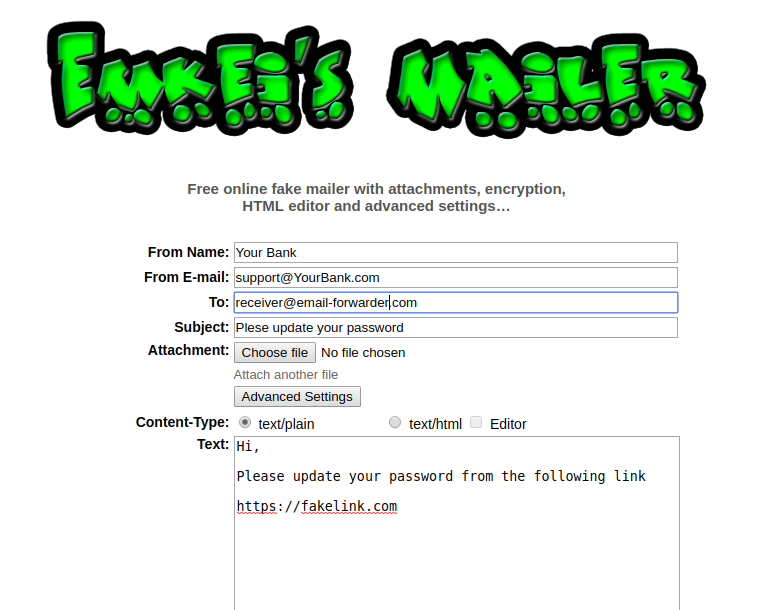

# Basics

#### SPF   

A Sender Policy Framework (SPF) record is a type of Domain Name Service (DNS) TXT record that identifies which mail servers are permitted to send email on behalf of your domain. The purpose of an SPF record is to detect and prevent spammers from sending messages with forged From addresses on your domain. 


#### DKIM    

DKIM stands for DomainKeys Identified Email and provides a way to validate that an organization delivering an email has the right to do so. It is an email security standard designed to make sure messages weren’t altered in transit between the sending and recipient servers. It uses public-key cryptography to  sign email with a private key as it leaves a sending server. Recipient servers  can then use a public key published to a domain’s DNS to verify the source of  the message, and that the body of the message hasn’t changed during transit. 
          
Selectors are extracted form DKIM-signature header and according to selector the DKIM policy is extracted from DNS to verify the email.


#### DMARC  

DMARC, which stands for “Domain-based Message Authentication, Reporting & formance”, is an email authentication, policy, and reporting protocol. It builds on the widely deployed SPF and DKIM protocols, adding linkage to the author (“From:”) domain name, published policies for recipient handling of  authentication failures, and reporting from receivers to senders, to improve and monitor protection of the domain from fraudulent email.

Commands to query these records

| Record |    Windows Command Line    |         Mac OS/Linux Terminal     |
|--------|:---------------------------|:----------------------------------|
| SPF    |nslookup  -type=txt domain  |dig txt domain                     |
|--------|----------------------------|-----------------------------------| 
| DKIM   |>nslookup                   |dig txt selector._domainkey.domain |
|        |>set q=txt                  |                                   |
|        |>selector._domainkey.domain |                                   |
|--------|----------------------------|-----------------------------------| 
| DMARC  |nslookup -type=txt          |dig txt _dmarc.domain              |
|        | _dmarc.domain              |                                   |
|--------|----------------------------|-----------------------------------|


# Why are email forwarders prone to Email spoofing?

Many company use email forwarding functionality , they forward the email sent to employee's company email address to their personal email address , while forwarding they do not check the authenticity of incoming email i.e does not check email's SPF , DKIM and DMARC before forwarding and let the responsibility to the end receiver.
But while forwarding they additionally add their DKIM signature to the mail and also in some cases modify the fields in message header

According to [rfc6376](https://tools.ietf.org/html/rfc6376#page-34)

```
   A message might also have multiple signatures because it
   passed through multiple Signers.  A common case is expected to be
   that of a signed message that passes through a mailing list that also
   signs all messages.  Assuming both of those signatures verify, a
   recipient might choose to accept the message if either of those
   signatures were known to come from trusted sources.
   ```

Most of the Verifiers (receivers) choose to process signatures corresponding to the `From` field in the message header before other signatures.

When a receiver checks for SPF, the receiver looks at the domain found in the [RFC5321.MailFrom](https://tools.ietf.org/html/rfc5321#page-11) to figure out where to look for an SPF record. The RFC5321.MailFro address is the entity that is passed along as part of the “MAIL FROM” command during the SMTP conversation. When an SPF check successfully completes, the receivers ends up with an “Authenticated Identifier” that is the domain of the [RFC5321.MailFrom](https://tools.ietf.org/html/rfc5321#page-11) So at the receiver's end SPF check always get passed on behalf of the forwarder's IP and not the sender's IP.

DKIM is similar in that it also generates an “Authenticated Identifier”. However, DKIM’s identifier comes from the “d=” tag that is part of every DKIM signature which the sender choose ( mostly `From :` field in message header)

Since In the DMARC world, any Authenticated Identifier has to be relevant to the domain that DMARC is looking at, and that is always the domain found in the From: header of an email, which results in DMARC check get passed if any of the RFC5321.MailFrom domain or DKIM signature domain which the receiver choose matches with the "From" field in the message header .

I have seen mainly two vulnerable configurations of email forwarders

### First

In this case forwarders modifies the From field(or any other field which is included in `h=` tag of the original DKIM signature) in the message header and adds additional DKIM signatures.

When any of the fields in `h=` tag is modified the original DKIM signature becomes invalid.


Sender Sends to Forwarder (sender@gmail.com)
```
From                 :   sender@gmail.com 
To                   :   receiver@forwarder.com
DKIM-Signature       :   v=1; a=rsa-sha256; c=relaxed/relaxed;d=gmail.com;b=<signature>
```

Receiver Receives (receiver@yahoo.com)
```
From                 :  "sender@gmail.com" <mail-forwarder@forwarder.com>
To                   :  receiver@forwarder.com
DKIM-Signature       :  v=1; a=rsa-sha256; c=relaxed/relaxed;d=gmail.com;b=<signature>      #gmail signature becomes invalid
DKIM-Signature       :  v=1; a=rsa-sha256; c=relaxed/relaxed;d=forwarder.com;b=<signature2>
```

SPF and DKIM both passes with forwarder.com DNS records. The end receiver chooses the domain inside the "< >" i.e forwarder.com  to verify the DMARC record, which always pass as SPF and DKIM both passes with the same domain. 

So in this scenario an attacker can spoof email of any domain as the original sender's email address get's inside the double quotes `"sender@gmail.com"`.                               

To trace email with full header in Gmail. 

Open the email you want to check the headers for.
Next to Reply , click More Show original.


### Second 

Forwarders that do not modify nay field in the message header but adds additional DKIM signatures.

Sender Sends to Forwarder (sender@gmail.com)
```
From                 :   sender@gmail.com
To                   :   receiver@forwarder.com
DKIM-Signature       :   v=1; a=rsa-sha256; c=relaxed/relaxed;d=gmail.com;b=<signature>
```

Receiver Receives (receiver@gmail.com)
```
From                 :  sender@gmail.com
To                   :  receiver@forwarder.com
DKIM-Signature       :  v=1; a=rsa-sha256; c=relaxed/relaxed;d=gmail.com;b=<signature>
DKIM-Signature       :  v=1; a=rsa-sha256; c=relaxed/relaxed;d=forwarder.com;b=<signature2> #both signatures are valid
```

Here SPF passes with forwarder.com ip address but DKIM passes with gmail's signature and since DMARC looks at the domain from From field in the message header , the attacker can only spoof emails  of forwarder.com domain , how ? see below 

Attacker Sends to Forwarder without any dkim signature with `From : <any-user>@forwarder.com>`
```
From                 :   sender@forwarder.com
To                   :   receiver@forwarder.com
```

Forwarder adds DKIM signature and forwards the email 
```
From                 :  sender@forwarder.com
To                   :  receiver@forwarder.com
DKIM-Signature       :  v=1; a=rsa-sha256; c=relaxed/relaxed;d=forwarder.com;b=<signature> 

NOTE: The email forwarders generally adds more than one DKIM signature before forwarding. If any company uses AWS SES to forward emails then the DKIM signature of AWS SES and the company's forwarder domain itself gets added.

So in this scenario an attacker can spoof email of domain whose DKIM signatures get's added by the forwarder i.e AWS SES and the company's forwarder doamin.                                                                                                       

# Exploitation

With services like https://emkei.cz/  it is quiet easy to  spoof any email for phishing purpose .




# Mitigation

One mitigation  is quiet obvious i.e validate email before forwarding, but it is a lot of work to implement SPF ,DKIM and DMARC checks.

There is one more simpler solution i.e when forwarder does not modify the field in the message header and does not adds additional DKIM signature .(This approach is used by gmail's auto forwarder)

